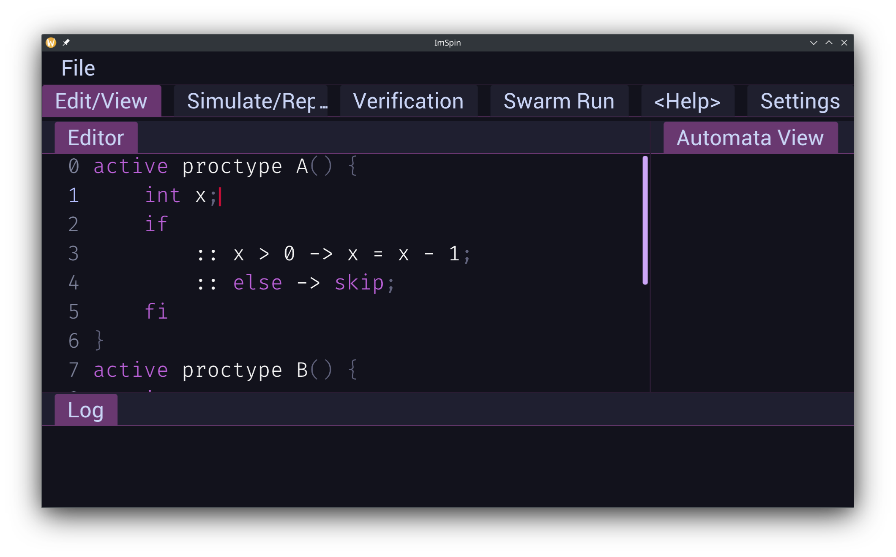

# ImSpin

ImSpin aims to be a modern replacement for iSpin Tcl/Tk, a frontend for the spin modelchecker.

ImSpin has the following features:

- Usable Code Editor with vim arrow movements
- Syntax Highlighting
- Resizeable GUI

